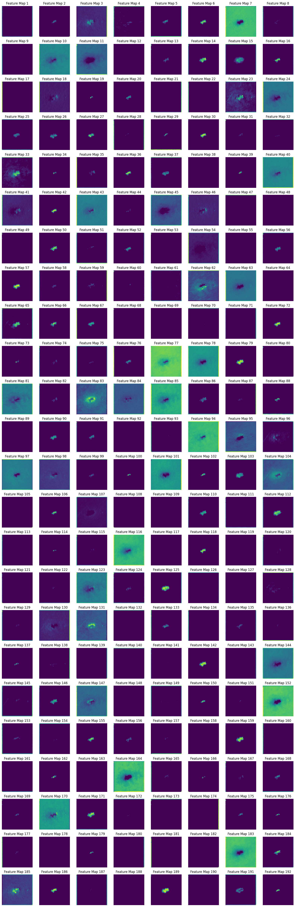

## Explainable AI for Benign images

Original Image

## Model 

## Each Layer Visualization for CNN 

Visualizing activations for layer: conv2d_30 ,
Shape of activations for layer 'conv2d_30': (224, 224, 192)

Shape of activations for layer 'max_pooling2d_30': (112, 112, 192)

Visualizing activations for layer: conv2d_31 ,
Shape of activations for layer 'conv2d_31': (112, 112, 192)

Shape of activations for layer 'max_pooling2d_31': (56, 56, 192)

Visualizing activations for layer: conv2d_32 ,
Shape of activations for layer 'conv2d_32': (56, 56, 224)

Shape of activations for layer 'max_pooling2d_32': (28, 28, 224)

Visualizing activations for layer: conv2d_33 ,
Shape of activations for layer 'conv2d_33': (28, 28, 256)

Shape of activations for layer 'max_pooling2d_33': (14, 14, 256)

Visualizing activations for layer: conv2d_34 ,
Shape of activations for layer 'conv2d_34': (14, 14, 224)

Shape of activations for layer 'max_pooling2d_34': (7, 7, 224)

