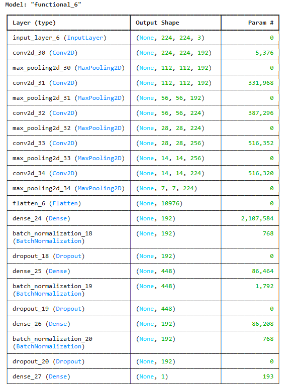
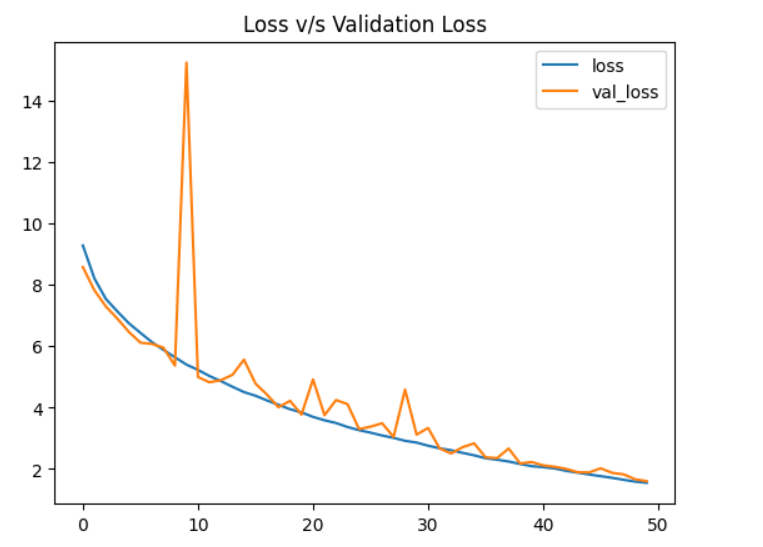

# Skin-Cancer-Detection

Skin cancer is one of the most common types of cancer, and early detection significantly improves treatment outcomes. 
This project aims to develop a machine learning model to classify skin moles as either benign or malignant using images. 
By leveraging a balanced dataset of skin moles, the goal is to create a reliable and efficient tool to assist 
healthcare professionals in diagnosing skin cancer.

## Dataset 
The dataset used for this project is sourced from Kaggle and consists of images of benign and malignant skin moles. The dataset is balanced, containing an equal number of benign and malignant samples. 

Dataset link - https://www.kaggle.com/datasets/fanconic/skin-cancer-malignant-vs-benign/data

## Model Architecture

1. **Data Preprocessing**:
   - Images were resized to a standard dimension of 224x224 pixels.
   - Pixel values were normalized to a range of 0 to 1.

2. **Model Architecture**:
   - A Convolutional Neural Network (CNN) model was designed with multiple convolutional layers, max-pooling layers, and dense layers.
   - The model includes regularization techniques such as dropout and L2 regularization to prevent overfitting.
   - Batch normalization was used to stabilize and accelerate training.

3. **Training**:
   - The model was trained using a balanced dataset with a batch size of 32.
   - Training was performed for 50 epochs with early stopping and model checkpointing to save the best-performing model based on validation loss.  

4. **Evaluation**:
   - The model's performance was evaluated on a separate test dataset using metrics such as accuracy, AUC (Area Under the Curve), and loss.
   - Final metrics include a test accuracy of 81.8%, a test AUC of 89.1%, and a test loss of 3.52.

## Results
The final model achieved an accuracy of 87.43% on the training set and 85.98% on the validation set. The model was tested on an unseen test set and achieved an accuracy of 81.82% and an AUC of 89.06%. 

Final Training Accuracy: 0.8743480443954468 
Final Validation Accuracy: 0.8598484992980957

Test Loss: 3.522998094558716
Test Accuracy: 0.8181818127632141
Test AUC: 0.8906390070915222

The model demonstrates strong performance in distinguishing between benign and malignant skin moles, with a high AUC indicating effective classification capability. The accuracy on the test set reflects the model’s generalization ability.

### Conclusion

This project showcases the potential of machine learning in assisting with skin cancer diagnosis. The developed model offers a promising tool for early detection, which can aid healthcare professionals in making informed decisions. Future work may include further optimization of the model, experimenting with different architectures, and integrating additional data sources to improve accuracy and robustness.

## Skin Cancer Detection Project:

- Developed a CNN model to classify skin moles as benign or malignant using a balanced dataset from Kaggle, achieving a test accuracy of 81.82% and an AUC of 89.06%.
- Implemented data preprocessing by resizing images to 224x224 pixels and normalizing pixel values, enhancing model performance and stability.
- Utilized training techniques such as dropout, L2 regularization, batch normalization, early stopping, and model checkpointing.

